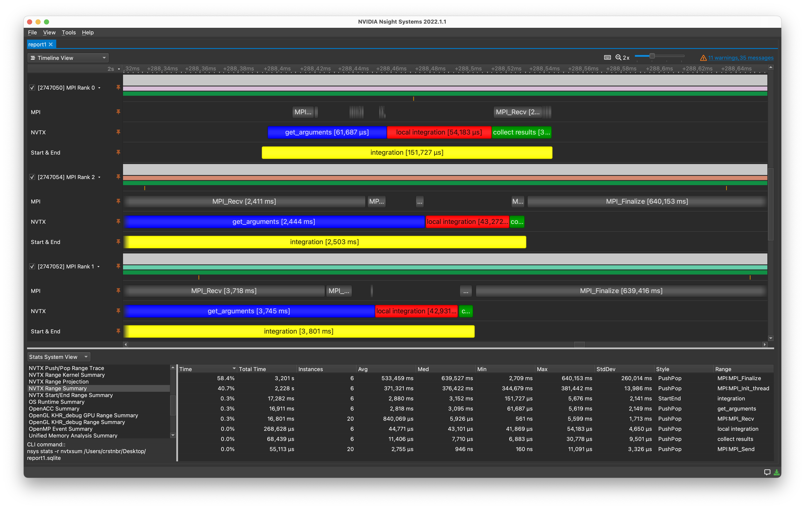
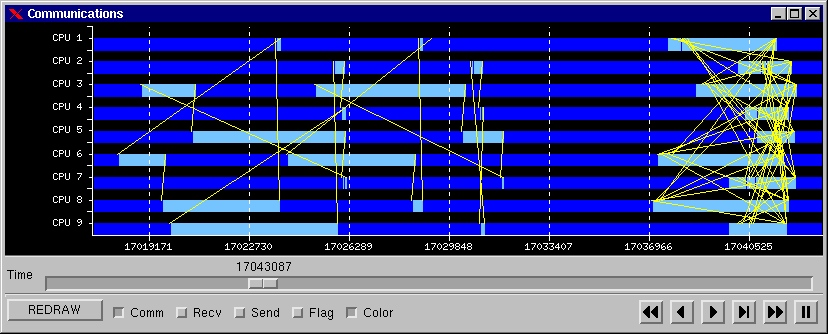
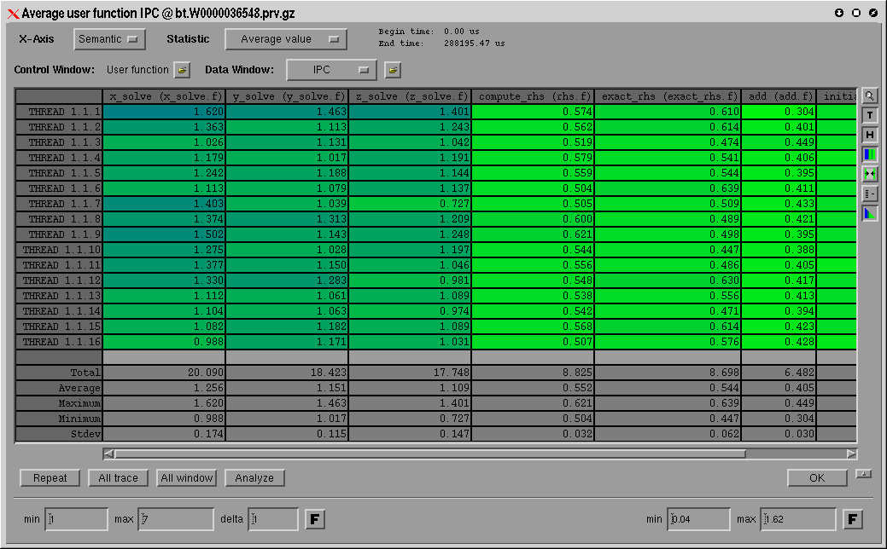
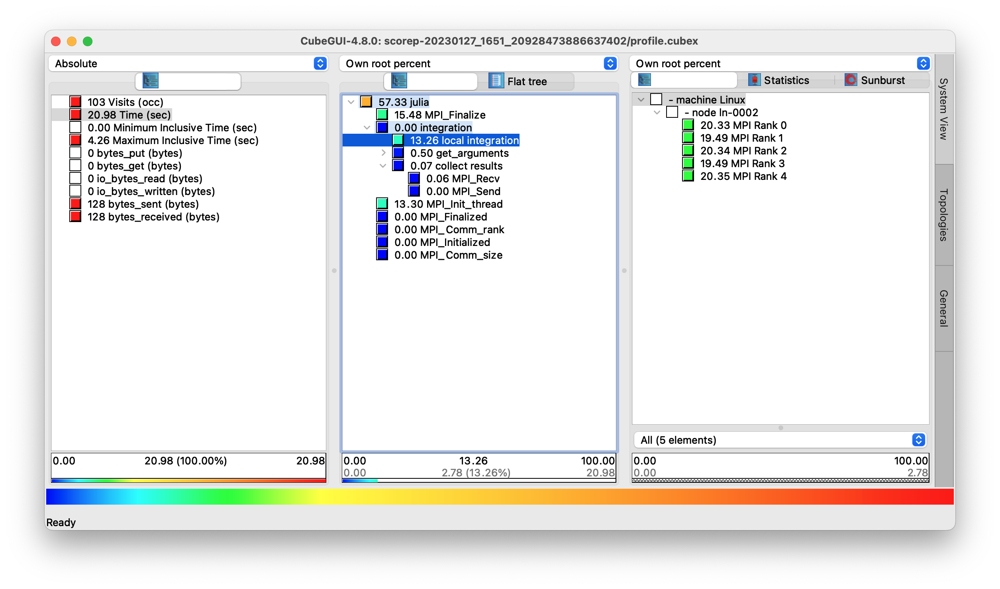
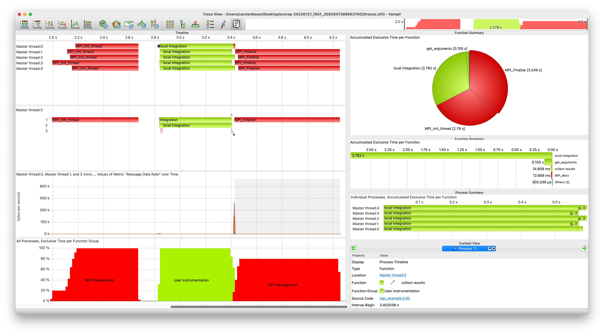
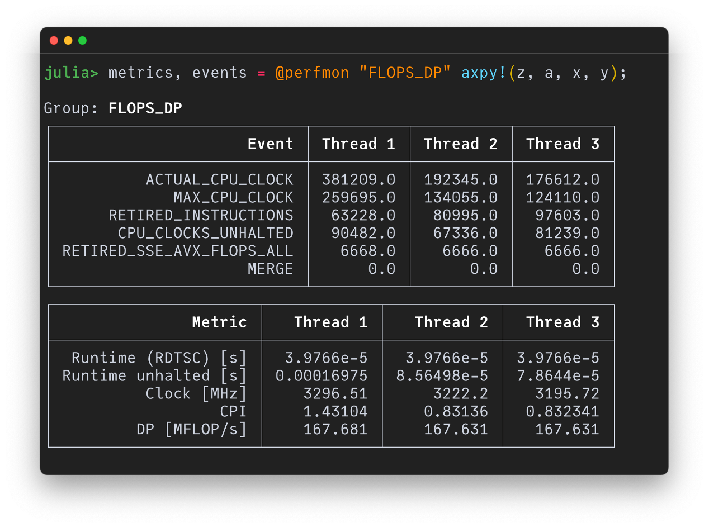
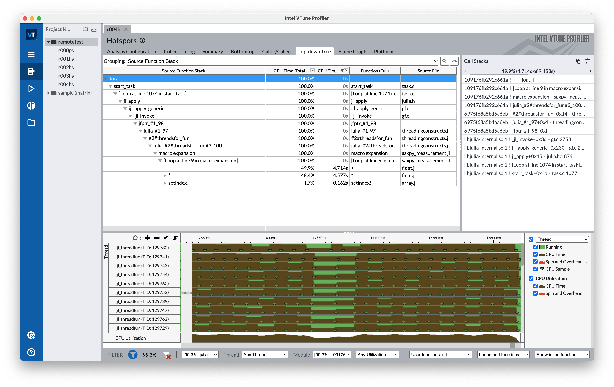

# HPC Profiling Tools

There are plenty of HPC tools for profiling out there. Figuring out which one is
good in what scenario and, more importantly, which one actually works with Julia
is non-trivial. This page will try to provide helpful orientation.

## NVIDIA Nsight Systems

Good for: GPU, MPI

[NVIDIA Nsight Systems](https://developer.nvidia.com/nsight-systems) is a
powerful profiling tool for analyzing (multi-)GPU and/or MPI-parallel
applications (the latter might be somewhat surprising). Especially useful when
combined with [NVTX.jl](https://github.com/JuliaGPU/NVTX.jl) for manual
instrumentation (you can name and even color sections of your code).

Examples:

* [Relevant
  section](https://cuda.juliagpu.org/stable/development/profiling/#NVIDIA-Nsight-Systems)
  of the [CUDA.jl](https://github.com/JuliaGPU/CUDA.jl) documentation

Impressions:

## Extrae

Good for: MPI, GPU, Threads

The Julia package [Extrae.jl](https://github.com/bsc-quantic/Extrae.jl) allows you to use [Extrae](https://tools.bsc.es/extrae) for analyzing parallel Julia applications. It will produce trace files that can be visualized and analyzed with [Paraver](https://tools.bsc.es/paraver).

Noteworthy limitations:
* The package isn't battle-tested.
* The Paraver GUI might be overwhelming and takes some getting used to.
* Only works on Linux.

Impressions (of Paraver):

## Score-P

Good for: MPI

The Julia package [ScoreP.jl](https://github.com/JuliaPerf/ScoreP.jl) allows you to use [Score-P](https://www.vi-hps.org/projects/score-p/) for analyzing MPI-parallel Julia applications. Output files are of type `.cubex` (profiling), which can be opened with, e.g., [Cube](https://www.scalasca.org/scalasca/software/cube-4.x/download.html) or [ParaProf](https://www.cs.uoregon.edu/research/tau/home.php), and `.otf2` (tracing), which can be opened with, e.g., [Vampir](https://vampir.eu/) or [Intel Trace Analyzer](https://www.intel.com/content/www/us/en/developer/tools/oneapi/trace-analyzer.html#gs.oc8bgr).

Noteworthy limitations:
* The package isn't battle-tested and currently experimental.
* While manual instrumentation works, automatic tracing of Julia functions isn't (yet) supported.

Examples:
* You're best chance is to check out the [README.md](https://github.com/JuliaPerf/ScoreP.jl/blob/main/README.md).
* Only works on Linux.

Impressions (of Cube and Vampir):
f

## LIKWID

Good for: intra-node hardware-level profiling

[LIKWID.jl](https://github.com/JuliaPerf/LIKWID.jl), named after the underlying eponymous benchmarking suite [LIKWID](https://github.com/RRZE-HPC/likwid), enables (interactive) monitoring of the performance of arbitrary Julia functions on a hardware level by examining hardware performance counters inside of CPUs (and NVIDIA GPUs).

Noteworthy limitations:

* Manual installation of LIKWID necessary (no JLL).
* Some features marked as experimental (but basic core is solid).
* Only works on Linux.

Examples:
* [Counting floating point operations of arbitrary Julia functions.](https://juliaperf.github.io/LIKWID.jl/stable/tutorials/counting_flops/)
* [Monitoring Performance on a Hardware Level With LIKWID.jl | Carsten Bauer | JuliaCon 2022](https://www.youtube.com/watch?v=l2fTNfEDPC0)

Impressions:

## Intel VTune Profiler

Good for: serial, multithreading, GC

The [Intel VTune
Profiler](https://www.intel.com/content/www/us/en/developer/tools/oneapi/vtune-profiler.html)
is a nice tool, e.g., for finding hot spots in your code. It supports local and
remote performance profiling. To make it work with Julia check out
[IntelITT.jl](https://github.com/JuliaPerf/IntelITT.jl) and our dedicated [Intel
VTune + Julia](intel_vtune.md) page.

Noteworthy limitations:

* Works best (only?) on systems with Intel CPUs.
* Can't profile on macOS (only remotely on Linux machine).
* May require compiling Julia from source (if you want more details, e.g., about GC).

Examples:

* [Intel VTune + Julia](intel_vtune.md) (e.g. remote usage via GUI)
* [Basic CLI Example](https://github.com/carstenbauer/julia-intelvtune)

Impressions:

## Other tools

If you know something about the following tools, in particular if and how it supports Julia, please make a PR!

* [TAU](https://www.cs.uoregon.edu/research/tau/home.php)
* [MUST](https://www.i12.rwth-aachen.de/go/id/nrbe) (MPI runtime correctness analysis)
* [PAPI](https://icl.utk.edu/papi/) / [PAPI.jl](https://github.com/JuliaPerf/PAPI.jl) (to be compared to LIKWID)
* [HPCToolkit](http://hpctoolkit.org/index.html)
